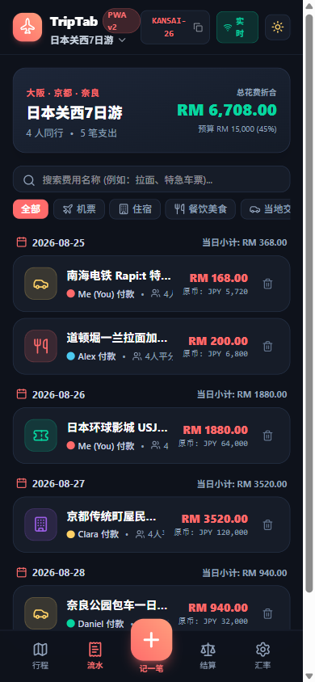
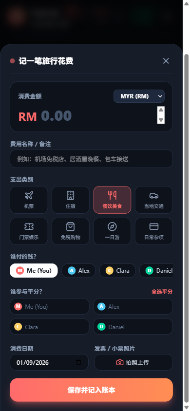
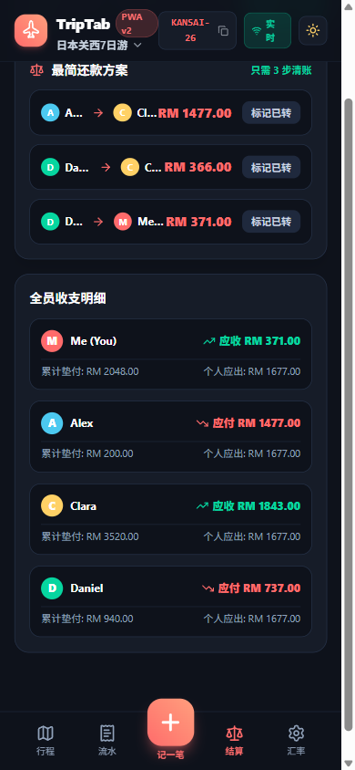
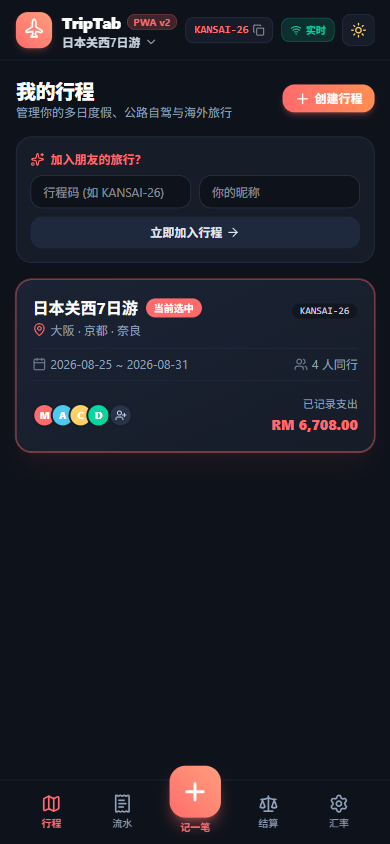

# ✈️ TripTab PWA (v2) — Modern Offline-First Travel Expense Single-Page Application

<div align="center">

[](https://sun524-bot.github.io/triptab-pwa/)
[](https://sun524-bot.github.io/triptab-pwa/)
[](https://react.dev/)
[](https://www.typescriptlang.org/)
[](https://tailwindcss.com/)
[-f59e0b?style=for-the-badge)](https://dexie.org/)

<p align="center">
  <strong>现代化离线优先旅行分账单页面应用 · Modern, Offline-First Travel Expense Splitting & Debt Simplification PWA</strong>
</p>

[🌐 在线使用 (Live Demo)](https://sun524-bot.github.io/triptab-pwa/) • [📱 安装指南](#-添加到手机主屏幕) • [✨ 核心特性](#-核心功能亮点) • [📐 架构设计](#-技术架构)

</div>

---

## 📸 应用界面截图 (Screenshots Gallery)

<div align="center">
  <table>
    <tr>
      <td width="25%" align="center">
        <strong>📋 每日流水时间线 (Timeline)</strong><br/><br/>
        
      </td>
      <td width="25%" align="center">
        <strong>➕ 极速抽屉记账 (Quick Add)</strong><br/><br/>
        
      </td>
      <td width="25%" align="center">
        <strong>⚖️ 最简还款结算 (Settlement)</strong><br/><br/>
        
      </td>
      <td width="25%" align="center">
        <strong>✈️ 多行程管理 (Trips)</strong><br/><br/>
        
      </td>
    </tr>
  </table>
</div>

---

## ✨ 核心功能亮点 (Key Features)

### 1. 📱 真正的单页面应用架构 (True Single-Page PWA)
- **0 毫秒瞬时切换**：告别多页面跳转造成的白屏闪烁与加载延迟，底部的 5 大标签页在内存中由 React 响应式渲染，体验媲美 iOS / Android 原生 App。
- **全屏原生体验**：支持 Web App Manifest 与 Service Worker 离线缓存，点击「添加到主屏幕」即可独立全屏运行。

### 2. ✈️ 100% 离线优先引擎 (Offline-First with Dexie.js)
- **万米高空飞行无忧**：出国旅游、在飞机上、地底地铁或偏远山区无网络信号时，点击桌面图标 **0 秒启动**。
- **高容量本地数据库**：基于浏览器底层 IndexedDB（Dexie.js v4），支持持久存储数百个行程、数千条支出明细及小票照片，永不卡顿。

### 3. 💱 实时多币种汇率换算 (Multi-Currency Converter)
- 支持 **MYR、SGD、JPY、THB、USD、EUR、GBP、CNY、TWD、KRW** 等主流旅行币种。
- 输入金额时，实时展示折合本币预览（如：`原币: JPY 6,800 ➔ 折合 RM 200.00`）。
- 内置离线汇率转换矩阵，断网也能精准核算。

### 4. ⚡ 图论贪心最小流网债务化简 (Greedy Debt Simplification)
- 采用图论最小流网贪心算法（$O(N \log N)$），将复杂的全团交叉垫付压缩至 **至多 $N-1$ 步最简转账**。
- **数学推导明细弹窗**：逐步展示任意两两成员之间「A 为 B 垫付」减去「B 为 A 垫付」的精确对冲过程。
- **一键群对账**：一键生成带格式的对账文本，直接粘贴到微信 / WhatsApp 旅行群。

### 5. 👥 零门槛免密临时入团 (Zero-Auth Companion Sharing)
- 队长创建行程后，同行朋友通过扫描二维码或点击专属链接（如 `?trip=KANSAI-26`），**无需注册邮箱或设置密码**，只需输入昵称即可加入行程共同查看账目。

### 6. 🌅 Sunset Voyage 暮色航程视觉体系
- 经典的暮色黑底（`#0e121b`）、晚霞珊瑚红（`#ff6b6b`）、翡翠绿（`#06d6a0`）与琥珀金。
- 顶部支持一键在暗黑（Dark）与明亮（Light）模式之间平滑切换。

---

## 🛠️ 技术架构 (Tech Stack)

| 模块 | 技术选型 | 说明 |
| :--- | :--- | :--- |
| **前端框架** | **React 19** + **TypeScript 5.7** | 最新一代响应式组件与严谨类型系统 |
| **构建工具** | **Vite 6** | 秒级热更新，极速 Rollup 静态分包编译 |
| **CSS 体系** | **Tailwind CSS v4** | 现代化原子类样式引擎与极轻量体积 |
| **离线存储** | **Dexie.js v4 (IndexedDB)** | 结构化离线本地数据库 |
| **云端实时** | **Supabase (PostgreSQL + Realtime)** | 多设备在线时毫秒级 WebSocket 状态广播 |
| **部署托管** | **GitHub Pages** (`gh-pages`) | 全球免费 HTTPS 加速分发 |

---

## 📲 添加到手机主屏幕 (Install to Home Screen)

- **iPhone (Safari)**：
  1. 在 Safari 中打开 [https://sun524-bot.github.io/triptab-pwa/](https://sun524-bot.github.io/triptab-pwa/)
  2. 点击屏幕底部的分享图标 `[↑]`
  3. 往下滑动选择 **「添加到主屏幕 (Add to Home Screen)」**
- **Android (Chrome / Edge)**：
  1. 在手机浏览器中打开 [https://sun524-bot.github.io/triptab-pwa/](https://sun524-bot.github.io/triptab-pwa/)
  2. 点击右上角菜单 `⋮`
  3. 选择 **「安装应用」** 或 **「添加到主屏幕」**

---

## 💻 本地运行与开发 (Local Development)

```bash
# 1. 克隆代码仓库
git clone https://github.com/sun524-bot/triptab-pwa.git
cd triptab-pwa

# 2. 安装依赖
npm install

# 3. 启动本地开发服务
npm run dev

# 4. 构建生产包并部署到 GitHub Pages
npm run build
npx gh-pages -d dist
```

---

## 🔒 双版本安全隔离声明 (Version Safety)

本应用为 **TripTab (v2 PWA)** 全新独立版本：
* **旧版仓库**：`https://github.com/sun524-bot/TripTab`（原封不动，正常运行）
* **新版仓库**：`https://github.com/sun524-bot/triptab-pwa`（独立演进，互不影响）

---

## 📝 开源协议 (License)

Distributed under the [MIT License](LICENSE).
